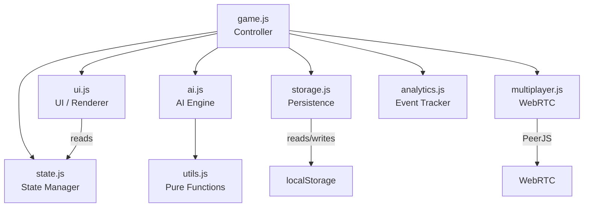

# Architecture — Tic Tac Toe Neon Arena

## Module Dependency Graph



## Module Responsibilities

### `state.js` — Reactive State Manager
- Single source of truth for all game data
- `getState()` / `setState(partial)` API
- `subscribe(fn)` for reactive updates — returns unsubscribe function
- Deep-merges nested objects (e.g. `stats`)

### `game.js` — Controller
- Entry point (`<script type="module" src="game.js">`)
- Orchestrates all other modules
- Handles user input (cell clicks, button clicks, keyboard)
- Manages game flow: start → move → check outcome → next round
- Wires up multiplayer, analytics, error monitoring

### `ai.js` — AI Engine
- **Easy**: random valid cell
- **Medium**: win → block → center → corner → random
- **Hard**: Minimax + alpha-beta pruning + memoization (board hashing)
- All functions are pure — no side effects

### `ui.js` — UI Renderer
- DOM manipulation: board rendering, popups, turn indicator
- Sound effects via Web Audio API
- Confetti, particles, animations
- Theme switching
- Stats panel rendering

### `storage.js` — Persistence
- localStorage wrapper with fallback
- Persists: scores, level, difficulty, theme, sound, stats
- Leaderboard CRUD (top 10)
- Stats persistence (separate key for lifetime data)

### `multiplayer.js` — WebRTC
- PeerJS wrapper for peer-to-peer connections
- Room create (generates 6-char code) / join (by code)
- Move sync, restart signals, disconnect handling
- Status callbacks for UI updates

### `analytics.js` — Event Tracker
- Lightweight localStorage-based event log
- Tracks: game_start, game_win, game_loss, game_draw, level_up, errors
- Capped at 500 events (FIFO)
- Summary statistics helper

### `utils.js` — Pure Functions
- `checkWinner(board, mark)` — returns winning combo or null
- `isBoardFull(board)` — boolean
- `getEmptyCells(board)` — array of indices
- `cloneBoard(board)` — shallow copy
- `createTimer(onTick)` — start/stop/getSeconds
- `WIN_COMBOS` — constant array of 8 winning lines

## State Shape

```javascript
{
  board: ['', '', '', '', '', '', '', '', ''],
  currentPlayer: 'X',
  gameStatus: 'idle', // 'idle' | 'playing' | 'won' | 'lost' | 'draw'
  isAIThinking: false,
  moveHistory: [{ index: 4, mark: 'X' }, ...],

  playerScore: 0,
  aiScore: 0,

  level: 1,
  levelProgress: 0,
  totalDraws: 0,
  consecutiveDraws: 0,
  difficulty: 'easy',

  stats: {
    gamesPlayed: 0,
    wins: 0,
    losses: 0,
    draws: 0,
    currentStreak: 0,
    bestStreak: 0,
    fastestWin: null,
  },

  theme: 'dark',
  gameMode: 'pvai',
  soundEnabled: true,
  myMark: 'X',
}
```

## Performance Optimizations

1. **AI Memoization** — Minimax results cached by board hash → ~10x speedup
2. **Alpha-Beta Pruning** — skips branches that can't improve the result
3. **Minimal DOM updates** — only changed cells are re-rendered
4. **CSS animations** — hardware-accelerated transforms
5. **`prefers-reduced-motion`** — disables all animations for users who prefer it
6. **Service Worker** — cache-first for instant loading

## PWA

- `manifest.json` — app name, theme color, standalone display
- `service-worker.js` — pre-caches all assets on install, cache-first fetch strategy
- Offline gameplay works after first visit
